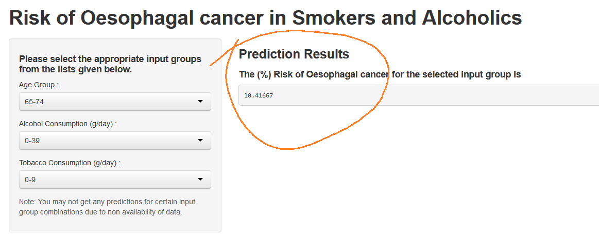
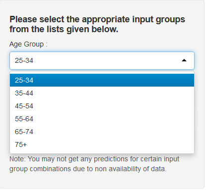
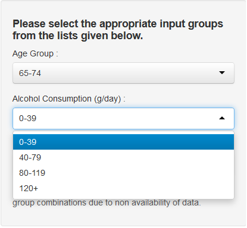

## Introduction

This application predicts the risk of developing Oesophageal cancer amongst smokers and alcoholics. The application predicts the cancer risk using the features such as the subject's Age group, Daily alcohol consumption and Daily tobacco consumption.

This application uses data from a case-control study of (o)esophageal cancer in Ille-et-Vilaine, France. This data named 'esoph' is available in the R datasets package.

```r
summary(esoph)
```

```
##    agegp          alcgp         tobgp        ncases        ncontrols   
##  25-34:15   0-39g/day:23   0-9g/day:24   Min.   : 0.00   Min.   : 1.0  
##  35-44:15   40-79    :23   10-19   :24   1st Qu.: 0.00   1st Qu.: 3.0  
##  45-54:16   80-119   :21   20-29   :20   Median : 1.00   Median : 6.0  
##  55-64:16   120+     :21   30+     :20   Mean   : 2.27   Mean   :11.1  
##  65-74:15                                3rd Qu.: 4.00   3rd Qu.:14.0  
##  75+  :11                                Max.   :17.00   Max.   :60.0
```


--- .class #id 

## Oesophageal Cancer Risk Predictions - Main Screen

The main screen is displayed below. The Oesophageal Cancer Risk Prediction for the selected age group, alcohol and tobacco consumption group is circled in red.

<div style='text-align: center;'>
    
</div>

--- .class #id 

## Selecting the age group and alcohol consumption group

You can select the subject's age group and alcohol consumption group from a dropdown list as shown below. Similarly you can also select the tobacco consumption group.

<div style='text-align: center;'>
    
    
</div>

--- .class #id 

## Conclusion

If this brief introduction has piqued your interest, feel free to have a peek at the actual application at the following URL:

https://rashmirn1.shinyapps.io/esoph/

As a bonus I have also included the R code used to generate this application at application site.

I sincerely hope that you find the actual application much more interesting than this brief commentary.


# *Thank You for your interest and time.*


